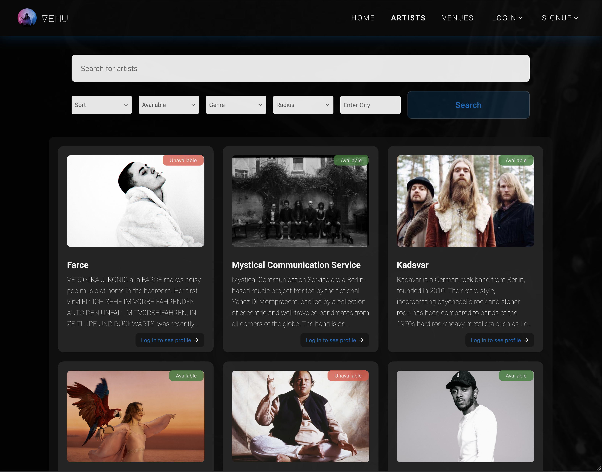

# Venu - Frontend

This project was done as a final project during the 1-year fullstack web development course at DCI and was developed over a period of 2 months.

Our goal was to build an application that allows musicians and venues to get in contact and book dates for upcoming shows and events.

## Technologies:

- The application is built in React.

- The app supports client-side routing with react-router-dom.

- Styling is done in SCSS

- For most of the animations and page transitions [framer motion](https://www.framer.com/motion/) comes into use.

- If the user allows, his/her location can be accessed via the geolocationAPI to allow searching for artists or venues in the area of the user

- Geocoding and address autocomplete is provided through the [geoapifyAPI](https://www.geoapify.com/)

  - When a user signs up or changes his/her address, the address is validated by fetching the corresponding coordinates for that location. The data is persisted to the database to enable geospatial queries and displaying markers on the map.
  - In the searchbar, searching for a city prompts the user with 3 suggestions. When the user clicks on a suggestion, the coordinates of that city will be used to enable searching in a specific radius (default is 10km).

- We made use of the [Formik library](https://formik.org/) in combination with [yup's schema validation](https://www.npmjs.com/package/yup).

- [Mapbox](https://www.mapbox.com/) is providing the map and generates custom markers based on the user type (artist or venue) of a user.

- The calendar and date picker are part of the ["react-multi-date-picker"](https://www.npmjs.com/package/react-multi-date-picker) by [shahabyazdi](https://github.com/shahabyazdi).

- In order to enable lazy loading images, we made use of the [React Lazy Load Image Component](https://www.npmjs.com/package/react-lazy-load-image-component)

- Generating LQIP's are generated via [cloudinary](https://cloudinary.com/).

- Event notifications are made possible through [hot-toast](https://react-hot-toast.com/).

- As a tool for uploading multiple images, we used [react-dropzone](https://react-dropzone.js.org/).

- Loading spinners are provided by David Hu's amazing [react-spinners](https://www.davidhu.io/react-spinners/).

## Live Version:

To see the live version please visit:

https://venu-frontend.onrender.com

If you want to check out the frontend repository, please visit:

https://github.com/Final-Countdown-Team/Venu-Backend
